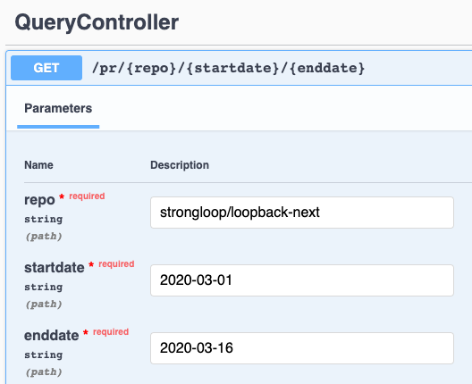

# loopback4-github-analytics

LoopBack 4 application for GitHub analytics

Note: this repo is still working in progress.

### LoopBack service to get PRs info

#### Step 1: Create a DataSource

1. Create a datasource with `REST service` as the connector.

   ```sh
   $ lb4 datasource? Datasource name: githubds
   ? Select the connector for githubds: REST services (supported by StrongLoop)
   ? Base URL for the REST service: https://api.github.com
   ? Default options for the request:
   ? An array of operation templates:
   ? Use default CRUD mapping: No
      create src/datasources/githubds.datasource.config.json
      create src/datasources/githubds.datasource.ts
   ```

2. Add operatinos template in datasource json

   I'd like to get the PRs merged in a specified repo during a specified period of time, so the GitHub query I'm using is `https://api.github.com/search/issues?q=repo:{repo}+is:{type}+{action}:{startdate}..{enddate}&per_page=100`.

   See [operation templates in the datasource json file](src/datasources/githubds.datasource.json).

#### Step 2: Creat service

1. Use `lb4 service` command

   ```sh
   $ lb4 service
   ? Service type: Remote service proxy backed by a data source
   ? Please select the datasource GithubdsDatasource
   ? Service name: GHQuery
      create src/services/gh-query.service.ts
      update src/services/index.ts

   Service GhQuery was created in src/services/
   ```

   In [GhQueryService](src/services/gh-query.service.ts), there is `GhQuery` interface and `GhQueryProvider` provider.

2. Matching with what I've created in the operation template in [datasource file](src/datasources/githubds.datasource.json), I have the following method in `QueryService`.

   ```ts
   getPRs(
      repo: string,
      type: string,
      action: string,
      startdate: string,
      enddate: string,
   ): Promise<QueryResponse>;
   ```

See [GhQueryService](src/services/gh-query.service.ts) for details.

#### Step 3: Create a controller

Create a controller using `lb4 controller` command with `Empty Controller` option.

```sh
$ lb4 controller? Controller class name: Query
Controller Query will be created in src/controllers/query.controller.ts

? What kind of controller would you like to generate? Empty Controller
   create src/controllers/query.controller.ts
   update src/controllers/index.ts

Controller Query was created in src/controllers/
```

See code in [QueryController](src/controllers/query.controller.ts).

#### Step 4: Try it out

Go to API Explorer,


## Running the application

Run:

```sh
npm start
```

## References

- Repo to show how to call REST and SOAP services in LB4: https://github.com/dhmlau/loopback4-external-apis
- [Calling other APIs and web services docs page](https://loopback.io/doc/en/lb4/Calling-other-APIs-and-web-services.html)
- GitHub API reference, https://developer.github.com/v3/

[-@2x.png>)](http://loopback.io/)
